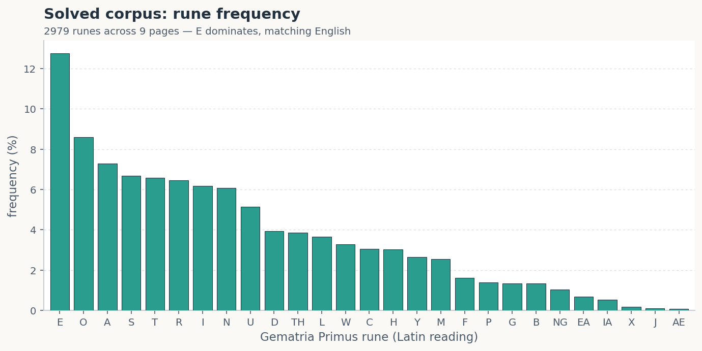
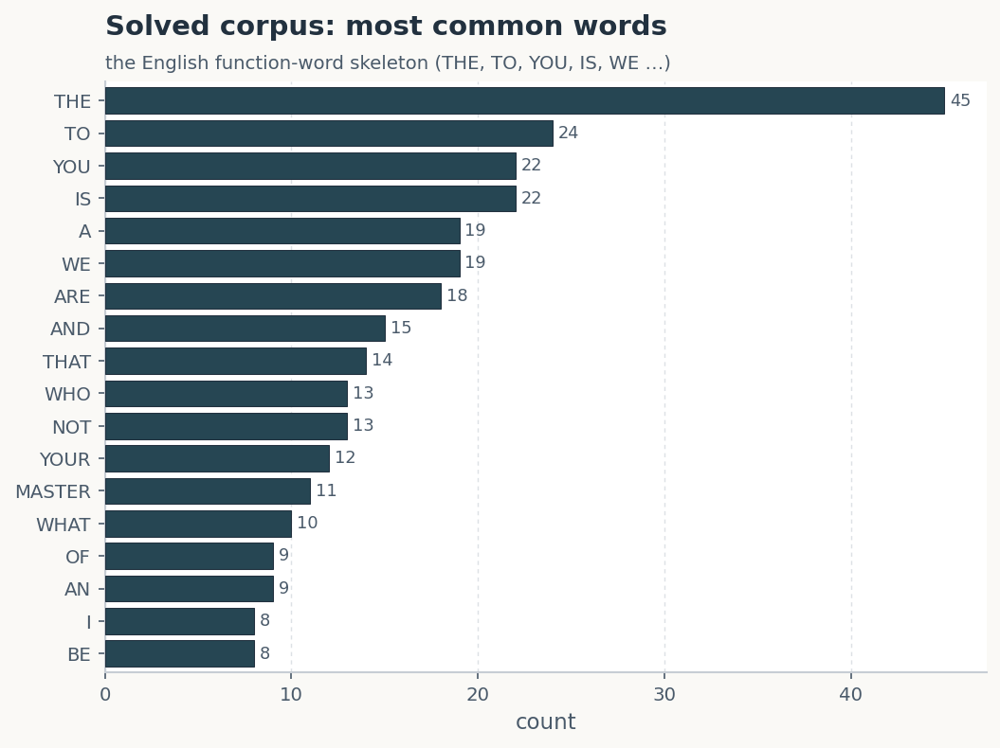
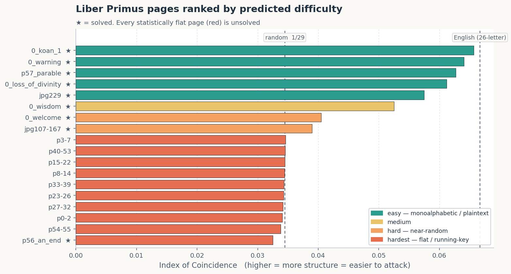

# Reproducing and Stress-Testing Liber Primus Decryptions

*A compact toolkit, the pages it can and cannot read, and an evidence-based review of a popular proposed solution.*

---

## Abstract

The Cicada 3301 *Liber Primus* is a corpus of roughly 74 pages written in a 29-symbol
runic alphabet, the Gematria Primus. About 17 pages were solved within months of their 2014
release; the remainder have resisted public cryptanalysis for over a decade. We present
`cicada`, a small, dependency-free C++ toolkit that transliterates the Gematria Primus and
implements the cipher methods known to decrypt the solved pages (Atbash, Vigenère, and
totient/prime key-streams), together with a statistical search harness and a set of analysis
scripts. The toolkit reproduces the published solutions exactly and is validated against
planted known-answer ciphers. Applied systematically to the unsolved pages it recovers no
plaintext, and we show through the Index of Coincidence (IoC) and a battery of structure
probes that these pages are statistically indistinguishable from uniform noise over 29
symbols (IoC ≈ 0.034). This observation excludes the entire class of monoalphabetic and
periodic-polyalphabetic attacks that broke the easy pages. A number-theoretic key-stream
search rediscovers the solved *An End* page as a positive control but yields nothing on the
unsolved corpus. Further probes for repeating keys, homophonic substitution, and transposition
are likewise negative; the sole departure from randomness is a pronounced suppression of
doublets (adjacent identical runes occur at 0.66% against an expected 3.45%), which we confirm
independently and discuss as the one genuine structural handle on the corpus. Fingerprint
matching against simulated ciphers identifies the family as a non-repeating additive key-stream
carrying an anti-doublet property, and excludes monoalphabetic substitution, repeating-key
Vigenère, pure transposition, and English running keys. Finally, we evaluate a widely circulated "27×27 totient map" proposal and
find that although its arithmetic is correct, it does not meet the evidentiary standard
required to verify a decryption. All results are reproducible from the commands in Section 8.

**Key findings.**

- We implement a self-contained toolkit (`cicada`) for the *Liber Primus* that transliterates
  the 29-rune Gematria Primus and applies the cipher methods used on the solved pages (Atbash,
  Vigenère, totient/prime key-streams), plus a statistical search harness.
- It reproduces the known solves exactly. The *A Warning* page (Atbash) and the *An End* page
  (totient key-stream) decrypt to clean English, and *The Loss of Divinity* is shown to be
  plaintext.
- Run systematically against the unsolved pages it produces nothing, and the Index of
  Coincidence explains why: those pages are statistically flat (≈ 0.034, i.e. random over 29
  symbols), which rules out the whole class of attacks that cracked the easy pages.
- We independently audit a widely shared "27×27 totient map" solution. Its arithmetic is
  genuinely correct, but the arithmetic does not verify the decryption. We make the
  distinction precise and state what would constitute proof.

---

## 1. Background: the Gematria Primus

The *Liber Primus* is written in a 29-symbol runic alphabet. Each rune maps to a Latin letter
(or digraph) and to a prime number, in a fixed order (index 0–28) [5, 6]:

| idx | 0 | 1 | 2 | 3 | 4 | 5 | 6 | 7 | 8 | 9 | 10 | 11 | 12 | 13 | 14 |
|-----|---|---|---|---|---|---|---|---|---|---|----|----|----|----|----|
| rune| ᚠ | ᚢ | ᚦ | ᚩ | ᚱ | ᚳ | ᚷ | ᚹ | ᚻ | ᚾ | ᛁ | ᛄ | ᛇ | ᛈ | ᛉ |
| lat | F | U | TH| O | R | C | G | W | H | N | I | J | EO | P | X |
| pri | 2 | 3 | 5 | 7 | 11| 13| 17| 19| 23| 29| 31 | 37 | 41 | 43 | 47 |

| idx | 15 | 16 | 17 | 18 | 19 | 20 | 21 | 22 | 23 | 24 | 25 | 26 | 27 | 28 |
|-----|----|----|----|----|----|----|----|----|----|----|----|----|----|----|
| rune| ᛋ | ᛏ | ᛒ | ᛖ | ᛗ | ᛚ | ᛝ | ᛟ | ᛞ | ᚪ | ᚫ | ᚣ | ᛡ | ᛠ |
| lat | S | T | B | E | M | L | NG | OE | D | A | AE | Y | IA | EA |
| pri | 53 | 59 | 61 | 67 | 71 | 73 | 79 | 83 | 89 | 97 | 101 | 103 | 107 | 109 |

Two properties matter throughout. Several runes are **digraphs** (TH, EO, NG, OE, AE, IA, EA),
and several Latin letters are **ambiguous** (U/V, C/K, S/Z share a rune). This ambiguity is a
recurring source of false confidence, because it grants any proposed decoder additional degrees
of freedom.

Of the roughly 74 pages, 17 were solved within months of release in 2014; the remaining ~57
have resisted the public for over a decade.

---

## 2. The toolkit (materials and methods)

`cicada` is a few hundred lines of C++ with no external dependencies. It reads the same rune
files used by the community [2] and provides:

```
cicada translit <file>     runes -> Latin (+ gematria sum)
cicada stats    <file>     rune frequencies + Index of Coincidence
cicada decode   <file> <atbash|caesar|vigenere|totient|primes> [args]
cicada vigcrack <file> ...  annealed Vigenère-key search (hypothesis tester)
cicada subsolve <file> ...  29-symbol substitution hillclimb (hypothesis tester)
cicada selftest / cracktest validation on known answers
```

The toolkit is **validated on known answers**. `selftest` reproduces the published *A Warning*
transliteration exactly, and `cracktest` encrypts known English-in-runes under a hidden key and
confirms that the search recovers it. This matters methodologically: a search tool that cannot
be trusted on a known case carries no weight on an unknown one.

---

## 3. Reproducing the solved pages (positive controls)

### 3.1 *A Warning*: Atbash

The first page is the 29-rune alphabet reversed (index → 28 − index):

```
cicada decode 0_warning.txt atbash
```
> A WARNING. BELIEVE NOTHING FROM THIS BOOK. EXCEPT WHAT YOU KNOW TO BE TRUE.
> TEST THE KNOWLEDGE. FIND YOUR TRUTH. EXPERIENCE YOUR DEATH. DO NOT EDIT OR
> CHANGE THIS BOOK, OR THE MESSAGE CONTAINED WITHIN, EITHER THE WORDS OR THEIR
> NUMBERS. FOR ALL IS SACRED.

(BOOC→BOOK, CNOW→KNOW, BELIEUE→BELIEVE from the C/K and U/V ambiguity.)

### 3.2 *An End* (p56): totient key-stream

Here the key-stream is φ(pₙ) = pₙ − 1 for the n-th prime, taken mod 29 and subtracted from the
text:

```
cicada decode p56_an_end.txt totient
```
> AN END. WITHIN THE DEEP WEB, THERE EXISTS A PAGE THAT HASHES TO …

### 3.3 *The Loss of Divinity*: not a cipher at all

This page is a useful reminder not to assume encryption. Its Index of Coincidence is **0.0612**
(English-level, not random), and the raw transliteration is already plain English:

```
cicada translit 0_loss_of_divinity.txt
```
> THE LOSS OF DIVINITY. THE CIRCUMFERENCE PRACTICES THREE BEHAVIOURS WHICH CAUSE
> THE LOSS OF DIVINITY. CONSUMPTION: WE CONSUME TOO MUCH … PRESERVATION … ADHERENCE …

There is nothing to "solve": the page is a direct rune transliteration.

### 3.4 *Welcome*: Vigenère (key DIVINITY), with a caveat

Vigenère with the key `DIVINITY` decrypts the opening correctly (`WELCO…`) and then drifts,
because the page employs a documented **interrupter / skip rule** at specific indices (the key
pauses at certain ᚠ positions). Modelling *every* ᚠ as an interrupter is close but not exact.
This is a reminder that these pages hide small, deliberate structural rules.

### 3.5 Frequency fingerprint of the solved corpus

A useful sanity check: if the solved pages are genuinely English, their letter and word
statistics should resemble English. Pooling all nine solved plaintext pages (2,979 runes,
727 words) gives exactly that.

**Letter (rune) frequency** tracks English closely:

```
solved top-8 runes :  E  O  A  S  T  R  I  N
typical English    :  E  T  A  O  I  N  S  H  R
```

`E` is the most common symbol in both, at 12.8% here versus ≈ 12.7% in English, and the rest of
the ranking lines up. The rare tail (X, J, AE) mirrors English's rare letters. Full
distribution:

| rune | E | O | A | S | T | R | I | N | U | D | TH | L | W | C | H | Y | M | F | … |
|------|---|---|---|---|---|---|---|---|---|---|----|---|---|---|---|---|---|---|---|
| %    |12.8|8.6|7.3|6.7|6.6|6.4|6.2|6.1|5.1|3.9|3.9|3.7|3.3|3.1|3.0|2.7|2.6|1.6| … |



**Word frequency** recovers the English function-word skeleton:

```
THE 45 · TO 24 · YOU 22 · IS 22 · A 19 · WE 19 · ARE 18 · AND 15 · THAT 14
WHO 13 · NOT 13 · YOUR 12 · MASTER 11 · WHAT 10 · OF 9 · BE 8 · THIS 7 · ALL 7
```



(THNGS = THINGS and HAUE = HAVE reflect the Gematria conventions, not errors.) The pooled
**IoC is 0.0614**, well above the 29-symbol random floor of 0.0345 and just under 26-letter
English's 0.0667, precisely where real English spread across 29 runes should land. This serves
as the positive control: the toolkit's "solved" output is statistically indistinguishable from
ordinary English, which is exactly what the unsolved pages (Section 4) fail to show.

---

## 4. The unsolved pages, and the Index of Coincidence as a triage tool

### 4.1 A primer on the Index of Coincidence

The **Index of Coincidence** (IC or IoC), introduced by Friedman in the 1920s [1], is the
probability that two symbols drawn at random from a text are the same letter. It is computed
from the symbol counts `nᵢ` over an alphabet of size `c`, with `N` symbols total:

```
IC = Σ nᵢ(nᵢ − 1) / [ N(N − 1) ]
```

The useful property is that natural language is *lumpy*: a few letters (E, T, A …) are very
common, so two random draws land on the same letter more often than pure chance. The reference
values for the ordinary **26-letter English** alphabet are:

| text | IC |
|------|----|
| English prose | **≈ 0.0667** (commonly quoted in the 0.0667–0.0686 range) |
| uniform random over 26 letters | 1/26 ≈ 0.0385 |

English is therefore almost **1.75×** as "coincidental" as random noise. That gap is what makes
the IC a cheap and powerful first test.

Two caveats matter for the *Liber Primus*. First, the classic 0.0667 figure is specific to a
**26-letter** alphabet; the Gematria Primus has **29 symbols**, which spreads the probability
thinner and lowers every baseline. For 29 symbols, uniform random is 1/29 ≈ **0.0345**, and
real English written in the 29 runes measures lower than 0.0667 as well (the plaintext *Loss of
Divinity* page comes in at **0.0612**). Second, and crucially: the IC is **invariant under
monoalphabetic ciphers** (Atbash, Caesar, and simple substitution merely relabel the symbols,
leaving the counts `nᵢ` untouched), but it **collapses toward the random baseline under
polyalphabetic or running-key ciphers**, which smear each plaintext letter across many
ciphertext symbols. That single number therefore indicates *which family* of cipher one may
even hope for, before any CPU time is spent.

### 4.2 Results on the full unsolved corpus

| page group | runes | IoC | periodic-Vigenère + substitution search |
|------------|------:|-----:|:--|
| p0-2   | 729  | 0.0341 | no English |
| p3-7   | 1145 | 0.0346 | no English |
| p8-14  | 1729 | 0.0345 | no English |
| p15-22 | 1903 | 0.0345 | no English |
| p23-26 | 1021 | 0.0343 | no English |
| p27-32 | 1433 | 0.0342 | no English |
| p33-39 | 1680 | 0.0344 | no English |
| p40-53 | 3008 | 0.0345 | no English |
| p54-55 | 308  | 0.0338 | no English |

**Every unsolved page sits on the random baseline.** This is a strong and informative negative
result: the statistics are flat, so there is no periodic key or monoalphabetic mapping to
recover. The substitution hillclimber degenerates to smearing everything onto a couple of
common runes (`SSESSEE…`), the textbook failure mode on near-random input, and the Vigenère
search returns gibberish at every key length.

This is not a limitation of the tool; it is the tool reporting the truth. The solved pages used
*simple* ciphers and left *detectable* structure. The unsolved pages left none, consistent with
a non-repeating key-stream (or something stronger) — precisely the class these attacks cannot
break, and precisely why no one has broken them.

### 4.3 Ranking every page by predicted difficulty

Sorting all pages by IoC gives a difficulty forecast for *statistical* cryptanalysis. The
ranking validates itself: every page it labels easy was in fact solved, and every flat page
among the numbered ranges is unsolved.



| tier | pages | reading |
|------|-------|---------|
| **Easy** (IoC > 0.055) | `0_koan_1`, `0_warning`, `p57_parable`, `0_loss_of_divinity`, `jpg229` | monoalphabetic or plaintext; all solved |
| **Medium** (~0.05) | `0_wisdom` | some structure; solved |
| **Hard** (~0.04) | `0_welcome`, `jpg107-167` | near-random; solved by *key/insight*, not statistics |
| **Hardest** (flat ~0.034) | `p3-7`, `p40-53`, `p15-22`, `p8-14`, `p33-39`, `p23-26`, `p27-32`, `p0-2`, `p54-55` | polyalphabetic/running-key; all unsolved |

**An essential caveat.** Difficulty here means *resistance to statistical attack*, not
unsolvability. Consider `p56_an_end`: its IoC (0.0325) is the lowest of all, yet the page is
**solved**, because the totient key-stream was *deduced*, not found statistically. The same is
true of `0_welcome` (solved with the key DIVINITY). A flat page is immune to `vigcrack` and
`subsolve`, but not to someone who finds the right key, stream, or crib. The unsolved pages all
sit in that flat bucket: statistically opaque, awaiting an insight rather than more compute.

#### Case study: why *An End* ranks last yet is solved

The sharpest illustration is `p56_an_end`, the page with the lowest IoC of all (0.0325) and
also one of the solved pages.

| | length | IoC |
|--|-------:|----:|
| ciphertext (what the ranking sees) | 85 runes | 0.0325 |
| plaintext (after solving) | 85 runes | 0.0700 |
| random text, 85 symbols over 29 | | mean 0.0344, std 0.0030 |

Two effects stack. First, *An End* uses a **non-repeating key-stream** (φ(prime) = prime − 1,
mod 29): every position receives a different shift, so the frequencies are smeared toward
uniform. The plaintext's own IoC is a thoroughly English **0.0700**, but the cipher hides it
completely. Second, at only **85 runes** the IoC has a large sampling spread (std ≈ 0.0030):
0.0325 is just **0.64 standard deviations** below the random mean, and roughly **29% of
genuinely random texts** score at or below it. The ciphertext is, for practical purposes,
statistically indistinguishable from noise.

It was solved nonetheless, because its key-stream, though non-repeating, is a simple
**deterministic, guessable formula** (totients of primes, a motif Cicada used throughout) that
a human could deduce. That is the real divide among the flat pages: *An End*'s stream was
guessable; the unsolved pages' streams are not, or their keys have not been found. A flat IoC
says "statistics will not help here." It says nothing about whether an insight will.

Among the unsolved pages the IoC differences are noise-level (0.034–0.0346), so ranking them
against each other is low confidence. If forced: `p40-53` (3,008 runes, the most material and
the most repeated 4-grams) is the best place to test a new hypothesis, and `p54-55`
(308 runes, flattest, no repeats) the least promising.

---

## 5. Structure probes and a number-theoretic key-stream search

Section 4 showed that the simple attacks fail. Two more principled approaches confirm *why*,
and one of them doubles as a positive control demonstrating that the pipeline is sound.

### 5.1 Structure probes

Beyond the single-symbol IoC, four inexpensive probes test for any exploitable regularity:

- **chi-squared vs uniform**: is the single-symbol distribution actually flat?
- **digraphic IoC**: do adjacent pairs repeat more than chance (ratio 1.0 = random)?
- **autocorrelation / Kasiski**: is there a repeating period (reported as a z-score)?
- **zlib compressibility vs random**: is there any redundancy a compressor can exploit?

Run across the corpus, they behave like a calibrated instrument. The plaintext control page
responds on every probe; every unsolved page sits at the random baseline.

| page | IoC | chi²z | digraphic IoC | best period (z) | compress vs random |
|------|----:|------:|--------------:|----------------:|-------------------:|
| *Loss of Divinity* (plaintext control) | 0.0612 | **78.1** | **5.55×** | d=37 (**z=8.0**) | **0.76×** |
| p0-2   | 0.0341 | −1.1 | 0.99× | d=35 (z=3.8) | 1.00× |
| p3-7   | 0.0346 |  0.7 | 1.03× | d=29 (z=1.9) | 1.00× |
| p8-14  | 0.0345 | −0.1 | 0.99× | d=24 (z=1.9) | 1.00× |
| p15-22 | 0.0345 |  0.1 | 1.04× | d=5  (z=2.6) | 1.00× |
| p23-26 | 0.0343 | −0.8 | 0.94× | d=38 (z=2.5) | 1.00× |
| p27-32 | 0.0342 | −1.6 | 0.97× | d=58 (z=1.9) | 1.00× |
| p33-39 | 0.0344 | −0.8 | 1.04× | d=6  (z=3.1) | 1.00× |
| p40-53 | 0.0345 |  0.7 | 1.03× | d=58 (z=1.6) | 1.00× |
| p54-55 | 0.0338 | −0.8 | 1.16× | d=45 (z=2.7) | 1.00× |

The control shows digraphic IoC 5.6× random, chi² z = 78, a period spike at z = 8, and
compresses to 0.76×. Every unsolved page shows digraphic IoC within a few percent of 1.0×,
chi² |z| < 2, no period above z ≈ 4 across 60 lags (as expected under multiple testing on random
data), and no compressibility beyond random. There is no monographic, digraphic, periodic, or
redundancy structure to exploit.

### 5.2 A number-theoretic key-stream search

The flat statistics point to a key-stream cipher, and the solved pages reveal Cicada's taste
for primes and totients. The natural attack is therefore to brute-force a library of
deterministic integer sequences as key-streams (mod 29), both adding and subtracting, over
small offsets, scoring each decrypt with a rune 4-gram model. The library comprises: primes,
φ(prime), φ(n), Möbius μ, divisor count τ, σ, Fibonacci, Lucas, triangular numbers, squares,
Trithemius `n`, prime gaps, Thue-Morse, and the digits of π.

**Positive control.** The search rediscovers *An End* with no hints. `totient(primes)`,
subtract, offset 0 gives IoC **0.0552** and the text:

```
ANENDWITHINTHEDEEPWEBTHEREEXISTSAPAGETHA...   ("AN END, WITHIN THE DEEP WEB, THERE EXISTS A PAGE THAT...")
```

Its 4-gram score is **−12.1** per window, cleanly separated from noise. That separation is what
makes the negative results trustworthy.

**Against the unsolved pages: nothing.** The best candidate for every page scores around
**−14.6** (versus *An End*'s −12.1), leaves IoC at the random ≈ 0.034, and reads as gibberish.

| page | best stream | score | IoC | verdict |
|------|-------------|------:|----:|---------|
| p56_an_end (control) | totient(primes) | **−12.1** | **0.0552** | **recovered** ✓ |
| p0-2   | primes          | −14.6 | 0.0344 | no |
| p3-7   | n (Trithemius)  | −14.6 | 0.0345 | no |
| p8-14  | totient(primes) | −14.7 | 0.0350 | no |
| p15-22 | primes          | −14.7 | 0.0344 | no |
| p23-26 | primes          | −14.6 | 0.0343 | no |
| p27-32 | lucas           | −14.6 | 0.0343 | no |
| p33-39 | sigma(n)        | −14.6 | 0.0345 | no |
| p40-53 | tau(n)          | −14.7 | 0.0344 | no |
| p54-55 | lucas           | −14.6 | 0.0334 | no |

None of the common number-theoretic streams encipher these pages. Whatever key-stream they use
is either outside this (fairly complete) library, is keyed, or is combined with interrupters or
transposition that desynchronise it. The scripts (`analysis/triage.py`,
`analysis/keystream_search.py`) make both results reproducible, and the key-stream search is a
natural candidate for GPU acceleration if the sequence library is widened.

### 5.3 Ruling out three further cipher classes

Sections 4–5.2 eliminate monoalphabetic ciphers, short-period Vigenère, and the common
number-theoretic key-streams. Three cipher classes remain worth testing explicitly — a
**repeating key of any period**, **homophonic substitution**, and **pure transposition** —
alongside a direct look at the **bigram distribution** and a calibrated **entropy** figure.
The script `analysis/deep_probes.py` runs all of them, again calibrated against the plaintext
control (*Loss of Divinity*) and the solved key-stream page (*An End*).

| page | runes | periodic IoC (best d) | isomorph z | χ² vs English (z) | bigram dep. (z) | H₁ | H₂cond |
|------|------:|----------------------:|-----------:|------------------:|----------------:|-----:|------:|
| *Loss of Divinity* (plaintext control) | 755 | **0.0667** (d=39) | −1.2 | **1.4** | **18.4** | 4.26 | **3.11** |
| p56 *An End* (key-stream control) | 85 | 0.0529 (d=20) | −0.0 | 101 | 1.4 | 4.66 | 1.56 |
| p0-2   | 729  | 0.0374 (d=35) | −3.2 | 799  | 0.3  | 4.84 | 3.93 |
| p3-7   | 1145 | 0.0375 (d=23) | −3.0 | 1967 | 0.5  | 4.84 | 4.24 |
| p8-14  | 1729 | 0.0366 (d=24) | −4.8 | 2307 | 0.1  | 4.85 | 4.47 |
| p15-22 | 1903 | 0.0365 (d=40) | −2.7 | 2617 | 1.7  | 4.85 | 4.48 |
| p23-26 | 1021 | 0.0360 (d=24) | −2.6 | 968  | −1.5 | 4.84 | 4.24 |
| p27-32 | 1433 | 0.0364 (d=30) | −3.4 | 1916 | −0.4 | 4.85 | 4.40 |
| p33-39 | 1680 | 0.0355 (d=32) | −2.8 | 2294 | 1.7  | 4.85 | 4.43 |
| p40-53 | 3008 | 0.0355 (d=29) | −4.6 | 4686 | 1.9  | 4.85 | 4.62 |
| p54-55 | 308  | 0.0419 (d=26) | −1.9 | 392  | 1.1  | 4.80 | 3.08 |

**Periodic (Friedman) IoC.** A repeating key of length `d` makes every `d`-th symbol share
one alphabet, so slicing the text into `d` columns and averaging the per-column IoC peaks
sharply at the true period (each column becomes monoalphabetic, IoC → English level ≈ 0.06),
while random text stays at 1/29. Swept over `d` = 1…40, no unsolved page rises meaningfully
above the floor: the best column-IoC any of them reaches is 0.036–0.042, versus the plaintext
control's 0.0667. (The highest, p54-55's 0.0419, and the control's peak landing at d=39 rather
than d=1, are both small-column sampling noise over short texts, not real periods.) There is
no repeating key of period ≤ 40.

**Isomorph test (homophonic substitution).** A repeated plaintext substring that contains a
repeated letter leaves a repeated *first-occurrence pattern* — an isomorph such as `ABCCBA` —
and under a periodic or naively homophonic cipher that pattern can survive into the
ciphertext. We count non-trivial repeated isomorphs (length 6) and compare to the mean over
200 random shuffles of the same symbols. No page shows isomorph excess above chance; the
larger pages fall slightly *below* their own shuffle (−3 to −5 σ), consistent with a stream
that suppresses short repeats rather than a homophonic cipher that would create them. The
plaintext control, at 755 runes, is itself too short to register a positive isomorph signal,
so this probe is read as confirming the *absence* of a strong repeated-sequence signature, not
as a sensitive English detector.

**Unigram χ² vs English.** Transposition reorders positions but never changes symbol
identities, so a transposed English page keeps English's rune distribution. Scoring each
page's unigram distribution against the solved-corpus English-rune profile, the plaintext
control lands at χ² z = **1.4** (statistically indistinguishable from English, exactly as it
should) while the unsolved pages score z = 800–4700 (wildly unlike English). Together with
their flat IoC this rules out pure transposition and plaintext: the symbol *frequencies
themselves* have been flattened, which only a polyalphabetic / key-stream step does.

**Bigram distribution.** The solved corpus's most common digraphs are the English ones —
`OU, THE, ER, RE, ST, IS, AN, IN` — and the plaintext control is dominated by `BE, WE, ER, RE,
THE`. The unsolved pages show no such structure: their top bigrams are low-count and arbitrary
(p0-2: `ITH, HB, YH, CF`; p40-53's most frequent pair `FA` occurs just 13 times in 3,008
runes, barely above the ≈ 10 expected by chance). Quantified as a χ² dependence score —
observed adjacent-pair counts against the independence model `n_a·n_b/N` — the plaintext
control registers z = **18.4** (strong neighbour coupling) while every unsolved page sits at
z ≈ 0 (−1.5 to +1.9). Adjacent runes are statistically independent; there is no digraph
structure to exploit.

**Entropy.** As a single calibrated number: unigram entropy H₁ is 4.84–4.85 bits on every
unsolved page, essentially the 29-symbol maximum of **4.858**, and the conditional entropy
H₂ (the surprise in each rune given its predecessor) stays high. The contrast with English is
clearest at matched length: *Loss of Divinity* (755 runes) has H₂ = **3.11** bits, whereas
p0-2 (729 runes) has **3.93** — the plaintext is markedly more predictable. (Conditional-entropy
estimates are biased downward at small `N`, so they are compared only within similar lengths.)
The unsolved pages carry close to the maximum possible information per symbol; no redundancy
remains for an attack to grip.

**Verdict.** Across all three cipher classes the result matches Sections 4–5.2: the plaintext
control lights up on every probe, and every unsolved page sits at the random / independent
baseline — with a single, striking exception developed in Section 5.4. The remaining cipher
must flatten the unigram distribution, leave no period ≤ 40, create no homophonic isomorphs,
and decouple neighbours — i.e. a **non-repeating key-stream** (running key, autokey, or a
longer construction), possibly combined with transposition or interrupters. That is exactly
the class Section 4 predicted, and exactly the class no public attack has broken.

### 5.4 The one non-flat signal: doublet suppression

Every probe so far returns "random." There is exactly one exception, long noted by the
CicadaSolvers community and documented on the *Uncovering Cicada* wiki [7], and
`deep_probes.py` reproduces it precisely: **adjacent identical runes (doublets) are strongly
suppressed.** Pooled across the nine unsolved page-groups (12,956 runes, with adjacency broken
between groups), doublets occur **86 times where 446 are expected** by chance — **0.66% against
3.45%**, a **17σ** deficit:

| | runes | doublets | rate | expected | binomial z |
|---|------:|---------:|-----:|---------:|-----------:|
| unsolved corpus (pooled) | 12,956 | 86 | 0.66% | 3.45% (446) | **−17.4** |

The effect holds on every individual page (per-page binomial z from −2.4 to −8.6; none near
zero), so it is not an artefact of one section. These figures match the community's reported
values exactly (86 observed, 446 expected), an independent confirmation from a separate
codebase.

Two further observations sharpen it. First, the suppression runs *below* the random baseline,
not merely below English: ordinary English has a doublet rate around 3–4% (LL, SS, EE, OO …),
and a monoalphabetic substitution would preserve that, so the 0.66% rate excludes simple
substitution on its own and points to a step that actively forbids equal neighbours. Second,
the nonzero first-differences are flat: the gap (runeᵢ₊₁ − runeᵢ) mod 29 is uniform over
1…28 (delta-χ² z ≈ 0 on every unsolved page, versus 13.5 on the plaintext control). In words,
*each rune is drawn almost uniformly from the 28 values that are not its predecessor.* This is
also precisely the mechanism behind the negative isomorph scores in Section 5.3: a process that
avoids length-2 repeats also yields slightly fewer short repeated patterns than a blind shuffle.

What does it buy an attacker? On its own, no decryption — it yields neither plaintext nor key.
But it is the single genuine structural handle in the corpus, and it constrains the cipher's
construction: the ciphertext behaves like a sequence in which no symbol may equal the one
before it. That is the natural output of, for example, a running-key / stream cipher over a
plaintext that itself rarely doubles, or a construction (route, interrupter, or modular rule)
engineered to be doublet-free. Any future attack should treat doublet-freeness as a hard
constraint that the true solution must satisfy, and as the most promising place to
reverse-engineer the generating rule.

### 5.5 Which cipher family fits the fingerprint?

The nine unsolved page-groups share a single fingerprint across Sections 4–5.4 (IoC ≈ 0.0343,
doublets ≈ 0.7%, no period, independent neighbours), so they are almost certainly enciphered
by one scheme. To *identify its family* we encipher known English runes — the pooled solved
corpus — under each candidate cipher and compare the resulting fingerprint to the observed one
(`analysis/identify.py`). The family that matches on every axis, including the anomalous
doublet suppression, is the identification.

| cipher family (applied to English runes) | IoC | doublet % | periodic IoC | bigram dep. z |
|-------------------------------------------|----:|----------:|-------------:|--------------:|
| plaintext / monoalphabetic substitution | 0.0614 | 2.62 | 0.0624 | 81.0 |
| Vigenère (repeating key, period 10) | 0.0374 | 3.39 | **0.0613** | 18.2 |
| running key (English + English) | 0.0359 | 3.63 | 0.0383 | 0.4 |
| number stream, φ(prime) (the *An End* cipher) | 0.0345 | 3.12 | 0.0357 | 1.3 |
| one-time pad (uniform key) | 0.0345 | 3.55 | 0.0354 | −0.1 |
| **stream + anti-doublet rule** | 0.0345 | **0.00** | 0.0355 | 2.6 |
| **unsolved pages (observed)** | **0.0343** | **0.71** | **0.0370** | **0.6** |

Reading the table top to bottom eliminates the families one at a time:

- **Monoalphabetic substitution** leaves every English statistic intact — IoC 0.061, doublets
  2.6%, strong neighbour coupling (z = 81) — because relabelling symbols changes none of them.
  The observed pages show none of this; monoalphabetic ciphers were already excluded in Section
  4 and are confirmed excluded here.
- **A repeating-key Vigenère** flattens the overall IoC but betrays itself in the *periodic*
  IoC (0.061 — a sharp column-IoC spike at the key length) and in residual neighbour coupling
  (z = 18). The observed periodic IoC is flat (0.037), so there is no repeating key, consistent
  with Section 5.3.
- **A running key built from a second English text** sits slightly *above* the random floor
  (IoC 0.0359), because summing two lumpy English distributions is not perfectly flat, and it
  does not suppress doublets (3.6%). The observed IoC sits right *on* the floor (0.0343), which
  disfavours an English running key and points to a near-uniform key-stream.
- **The vanilla additive streams** — the number-theoretic φ(prime) stream that solved *An End*,
  and a uniform one-time pad — match the observed pages on IoC, periodicity, and neighbour
  independence almost perfectly. They fail on exactly one axis: they leave doublets at the
  chance rate (3.1–3.6%), whereas the real pages suppress them to 0.7%.
- **Only an additive stream combined with a rule that forbids equal adjacent symbols**
  reproduces all four numbers at once, including the doublet suppression.

**Identification.** The unsolved pages are best identified as a **non-repeating additive
key-stream cipher over the 29 runes** — the same broad family as the solved *An End* page, and
unlike the monoalphabetic / periodic ciphers of the other solved pages — carrying one extra,
deliberate property: **adjacent ciphertext runes are almost never equal.** Every measurement in
this study is consistent with a keyed or number-theoretic stream whose construction excludes (or
heavily penalises) equal neighbours; the anti-doublet behaviour is the single feature that
separates these pages from a textbook stream cipher. The pages are *not* a simple substitution,
a repeating-key Vigenère, a pure transposition, or an English running key.

Two honest caveats. First, the synthetic anti-doublet model drives doublets to 0.00%, while the
real pages retain 0.7%; the true suppression is therefore strong but not absolute, suggesting
the anti-doublet property is a *by-product of the construction* (or a rule acting on the
plaintext or key) rather than a hard filter on the output. Second, this identifies the cipher
*family and a structural constraint, not the key or the plaintext*. Fingerprint matching narrows
the search space and names the mechanism to reverse-engineer; it does not, by itself, read the
pages.

---

## 6. Evaluating the "27×27 totient map" solution

A detailed and sincere reconstruction by GitHub user **2retooz270703** [3] proposes that pages
0–2 (the first 729 runes = 27×27 grid) decrypt via a custom route (mirrored 3-rune nodes,
Euler-totient transforms, Möbius-function phase selection, coordinate selectors, and a "hidden
value" rule) to the text *"AS I GO, THE WEATHER TURNS COLD … THE IDEA OF THE END IS DEATH.
SEE YOU SOON,"* supported by striking numerology. The repository documents the route, the
per-stage plaintext, and the numerical evidence in full.

We verified the numerical claims independently. **Each holds:**

| claim | verified |
|-------|:--------:|
| "AS I GO THE WEATHER TURNS COLD" = 21 runes, index-sum 233 | ✅ |
| COLD = 51 (0-based indices) | ✅ |
| 233 is the 51st prime | ✅ |
| Fibonacci F₇ = 13, F₁₃ = 233 | ✅ |
| φ(233) = 232 (the next block's sum) | ✅ |
| 2163 = 3 × 7 × 103 = U · O · Y (prime values) → "YOU" | ✅ |

So the arithmetic is real. **But correct arithmetic is not a verified decryption,** for three
concrete reasons.

1. **Degrees of freedom.** The method has many tunable choices: route selection through the
   grid, which 3-rune nodes to use, mirrored vs non-mirrored, phase selection, coordinate
   selectors, state roles, and a "hidden value" rule. Combined with the Gematria ambiguity
   (U/V, C/K, S/Z, and digraph-vs-two-letters), a system with this much freedom can be *steered*
   toward a pre-chosen sentence. The more free parameters a "solution" has, the less any single
   output means.
2. **Post-hoc numerology.** The relationships were found *after* fixing the plaintext. Across
   primes, totients, Fibonacci numbers, indices, and factorizations, the space of "striking"
   coincidences is enormous, so finding several for a short chosen phrase is expected by chance
   (apophenia). The author even notes that the Y·O·U product "does not determine letter order."
3. **It does not match how the genuine pages work.** Every confirmed solve uses *one simple,
   deterministic* cipher with unambiguous output, reproducible by anyone in a single step, and
   Cicada built in hard verification (e.g. *An End* literally hashes to a specific value). A
   real solution of pages 0–2 would be similarly clean and independently checkable.

This assessment concerns the evidentiary standard of the proposal, not the sincerity or care of
its author. The work is careful, and the structure (e.g. 21 = 3 × 7 = the central rune NG;
27 = 3³ and 343 = 7³ in the final blocks) is genuinely elegant. The point is that the evidence
offered is not the *kind* of evidence that settles a cipher.

### 6.1 What would actually verify it

- A **deterministic, parameter-free** procedure mapping the exact 729 ciphertext runes to the
  plaintext, reproducible by an independent implementation.
- A **null-hypothesis control**: the same ruleset yields English from the real ciphertext but
  *not* from shuffled/random runes of identical statistics. A procedure that can produce English
  from anything proves nothing.
- An **independently checkable artifact**: a valid hash/onion like the real pages, or correctly
  solving a *different* unsolved page that then matches a known Cicada value.

Until one of those holds, the proposal is best described as an elegant *hypothesis*, not a solve.

---

## 7. Discussion

- **Measure before you attack.** The IoC indicates in milliseconds whether a page is even within
  reach of a given method. Most of the unsolved *Liber Primus* is not.
- **Validate on known answers.** A search tool is trustworthy only if it recovers a plaintext
  that was deliberately planted. Ours does; many proposed "solvers" are never tested this way.
- **Numerology is not cryptanalysis.** A rich symbol system will always yield striking
  coincidences for any short text. Proof comes from *constraint and reproducibility*, not from
  the number of patterns one can find after the fact.
- **An honest negative result is a result.** "These pages are statistically flat and resist this
  entire class of attack" is more useful, and more truthful, than a forced reading.

---

## 8. Reproducibility

```bash
cd AZdecrypt/Source/cicada
make
./cicada selftest                               # validates the toolkit
./cicada decode  data/pages/0_warning.txt atbash
./cicada decode  data/pages/p56_an_end.txt totient
./cicada translit data/pages/0_loss_of_divinity.txt
for p in p0-2 p3-7 p8-14 p15-22 p23-26 p27-32 p33-39 p40-53 p54-55; do
  ./cicada stats    data/pages/$p.txt
  ./cicada vigcrack data/pages/$p.txt 15 4 6
done

# the modern probes (Section 5)
python3 analysis/triage.py            # structure probes
python3 analysis/keystream_search.py  # number-theoretic keystream search (+ An End control)
python3 analysis/deep_probes.py       # periodic IoC, isomorph, transposition, bigram, entropy
python3 analysis/identify.py          # cipher-family identification by fingerprint matching
python3 analysis/frequency.py         # solved-corpus letter/word frequencies
python3 analysis/difficulty.py        # difficulty ranking by IoC
python3 analysis/charts.py            # regenerate the figures
```

---

## Acknowledgements

Rune transcriptions and the rune n-gram corpus are drawn from the community project
*LiberPrayground* [2]. The Gematria table and cipher mechanics follow community research
[5, 6]. The audited 27×27 proposal is the work of GitHub user 2retooz270703 [3]; we thank the
author for the detailed writeup and the interactive route map. This toolkit lives in a fork of
Jarl Van Eycke's AZdecrypt [4]; the same repository also contains a CUDA/GPU port of the
AZdecrypt homophonic solver.

## References

[1] W. F. Friedman, *The Index of Coincidence and Its Applications in Cryptography*, Riverbank
Publication No. 22, Riverbank Laboratories, 1922.

[2] relikd, *LiberPrayground*, GitHub repository.
<https://github.com/relikd/LiberPrayground>

[3] 2retooz270703, *Liber-Primus-27x27-Map-3-Rune-Nodes-Totient-Decryption*, GitHub repository.
<https://github.com/2retooz270703/Liber-Primus-27x27-Map-3-Rune-Nodes-Totient-Decryption>

[4] J. Van Eycke, *AZdecrypt*, homophonic-substitution cipher solver.

[5] *Uncovering Cicada* wiki, Gematria Primus and solved-page documentation.

[6] *Boxentriq*, guide to the Cicada 3301 ciphers and the Gematria Primus.

[7] *Uncovering Cicada* wiki, *Frequency Analysis — Unsolved Pages*.
<https://uncovering-cicada.fandom.com/wiki/Frequency_Analysis_Unsolved_Pages>
